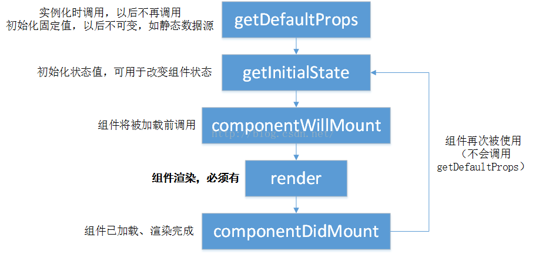

# React Native 笔记2

## 1 TextInput
#####  1. 继承自UIView，类似oc中的UITextField
#####   2. 相关属性:
* value字符串型 
* onChangeText函数
* keyboardType键盘类型
> url,default,number-pad
* multiline 布尔型 是否多行 TextView
* password 布尔型 只能一行~~
* clearButtonModel
* onChange 函数
* placeholder
 
  

## 引入外部js，方便iOS和android两端直接调用
//ES5
module.exports = XXXX;
//ES6
export default class MyComponent extends Component{
    ...
}
var XXXX = required('./xxxx.js');

## 适配两端
width和height采用Dimensions方式获取，不可写死

## 组件的生命周期

