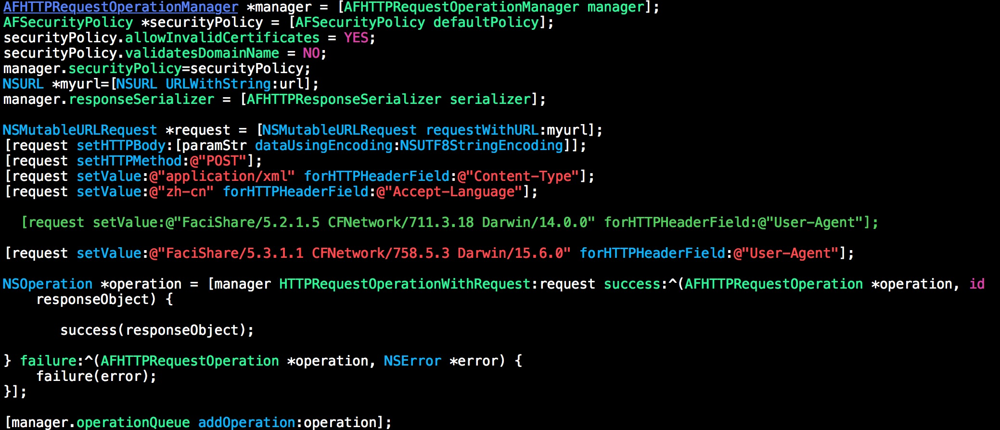
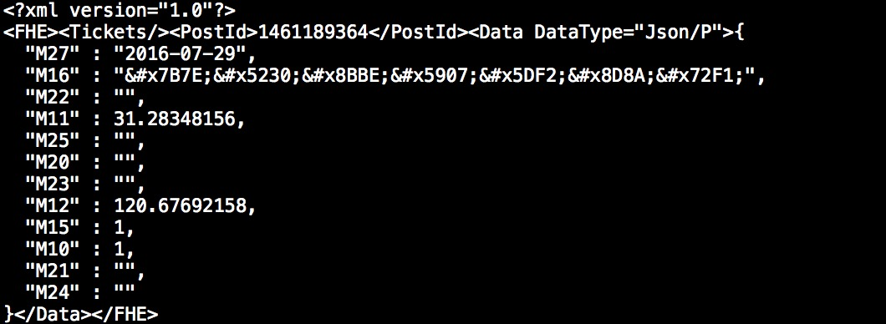

# 纷享销客签到

## 登录功能
> NSString *loginUrlStr=@"https://www.fxiaoke.com/FHE/EM0AXUL/Authorize/PersonalLogin/iOS.57?_vn=57&_ov=9.3.3&_postid=-1297570680&traceId=E-E..-19D1FD78-69D5-45D1-8103-7541561A7241"
> 使用AF post请求
> Header设置如下：
> post参数：`<?xml version="1.0"?>
<FHE><Tickets/><PostId>4166989841</PostId><Data DataType="Json/P">{
  "M1" : "账号",
  "M5" : "+86",
  "M2" : "密码"
}</Data></FHE>`,其中postid不重要，可以用自己抓包看到的postid
> 登录成功后，保存对应的cookie，后面签到要用到~~

## 签到/签退功能
> 请求接口:`https://www.fxiaoke.com/FHE/EM1AKaoQin/KaoQinApi/create/iOS.57?_vn=57&_ov=9.3.3&_postid=-1600297098&traceId=E-E.chinatave.1136-7F9E5FBC-7632-4C64-9B62-886BBC29B7B`
> 请求参数：**注意带上cookie请求**
> 
> M10字段：1表示签退，0表示签到